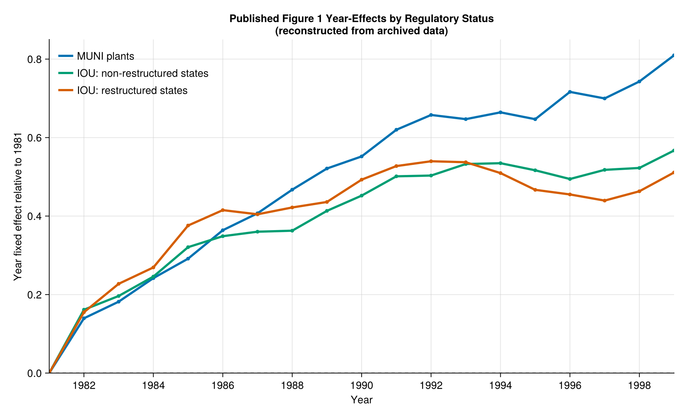
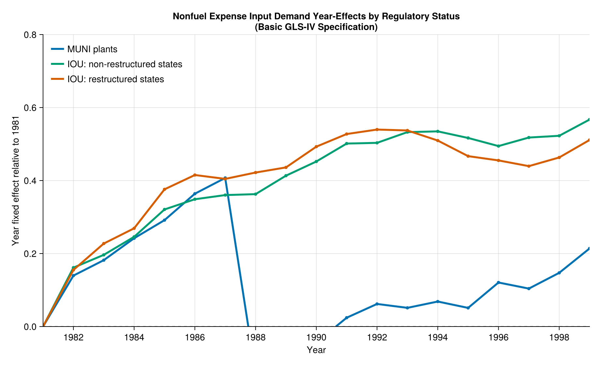

## Overview
This project replicates selected results from Fabrizio, Rose, and Wolfram (2007), "Do Markets Reduce Costs? Assessing the Impact of Regulatory Restructuring on US Electric Generation Efficiency." The paper studies whether electricity market restructuring reduced input use and costs at U.S. fossil-fuel power plants.

The goal of this project is not only to reproduce the final numbers, but also to organize the replication as a Julia package. The code is split into reusable functions, scripts, generated outputs, and tests.

## Replication Targets
The agreed replication targets are:

- Figure 1: labor input year effects;
- Figure 2: non-fuel expense year effects;
- Table 3: labor input demand;
- Table 4: non-fuel expense;
- Table 5: fuel input.

The original Stata replication package is used as the baseline implementation. The Julia code follows the same data files and estimation logic, while making the steps explicit and reproducible.

## Data
The raw data come from the openICPSR replication package for the paper. They are not committed to this repository, because they are external data files. After downloading the replication package, the code expects the files in:

```text
data/raw/openicpsr/116286-V1/
```

The main files used are:

- `frw1extract_enf.dta` for labor input and non-fuel expenses;
- `frw1extract_f.dta` for fuel input.

The script `scripts/01_check_data.jl` checks the data before estimation. The estimation sample has 10,079 observations for Tables 3 and 4, and 10,002 observations for Table 5.

## Method
The empirical specifications follow the original replication files. The regressions are not simple pooled OLS regressions: they include plant and time controls, and the GLS and GLS-IV specifications use a Prais-Winsten transformation to account for serial correlation.

In Julia, I implement this procedure directly. I first estimate the model and use its residuals to estimate the serial correlation parameter, rho. I then apply the Prais-Winsten transformation to the dependent variable and regressors and estimate the transformed model again. In the IV specifications, the same procedure is used after replacing output with its first-stage fitted value.

This was the most useful part of the replication exercise. Instead of treating the Stata output as a black box, the estimator is written step by step in Julia and checked with tests.

## Figures
Figure 1 reproduces the labor input year effects. I redrew the figure with clearer labels and a cleaner layout than the original paper.



Figure 2 reproduces the non-fuel expense year effects using the same style.



## Regression Tables
The regression tables are generated by `scripts/06_write_tables.jl`. The script reads the original data, runs the Julia estimators, and writes the tables below.

Standard errors are shown in parentheses. The estimates reproduce the published tables to the precision reported in the paper.







## Reproducibility

The project is organized as a Julia package. The main reusable code is in `src/`, scripts are in `scripts/`, figures are saved in `images/`, generated tables are saved in `tables/`, and tests are in `test/`.

The main outputs can be reproduced from the terminal with:

```bash
julia --project=. scripts/01_check_data.jl
julia --project=. scripts/04_figures_year_effects.jl
julia --project=. scripts/06_write_tables.jl
julia --project=. test/runtests.jl
```

The package also exposes a single entry point:

```julia
using DoMarketsReduceCostsReplication
run_all()
```

This runs the main replication workflow and makes the project easier to check as a package.

## Conclusion
The Julia replication reproduces the requested figures and regression tables from the paper. The main results are consistent: restructuring is associated with lower labor and non-fuel input use, while the fuel input effects are much smaller.

## References
Fabrizio, K., Rose, N., and Wolfram, C. (2007). "Do Markets Reduce Costs? Assessing the Impact of Regulatory Restructuring on US Electric Generation Efficiency." *American Economic Review*, 97(4), 1250-1277.

Original paper: <https://www.aeaweb.org/articles?id=10.1257/aer.97.4.1250>

Replication package: <https://www.openicpsr.org/openicpsr/project/116286/version/V1/view>
